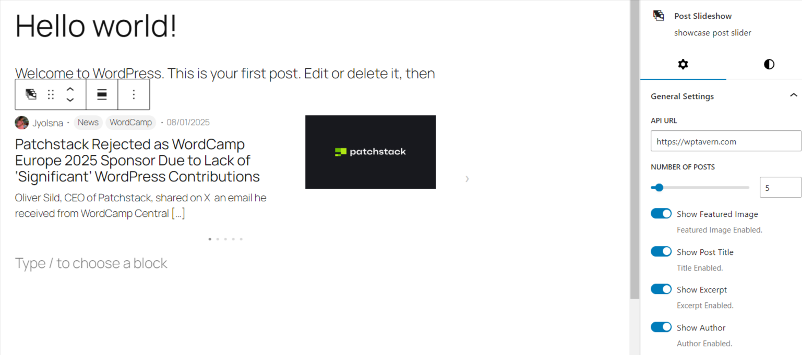
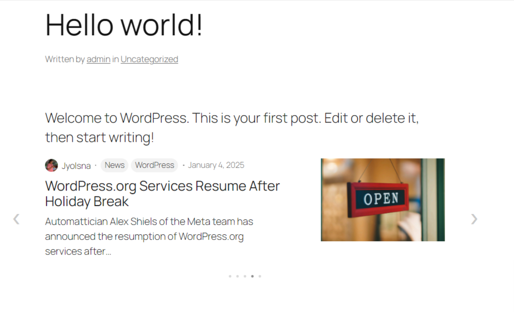
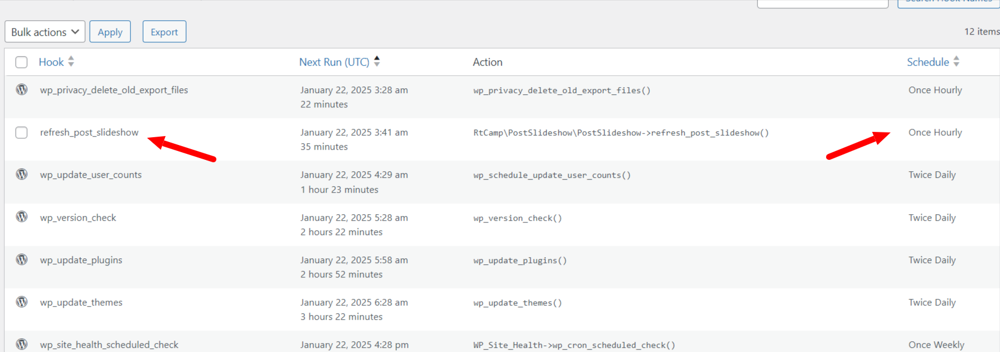
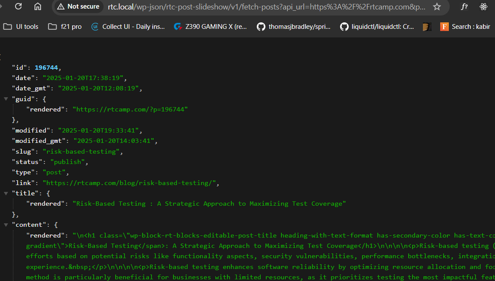

# rtCamp Post Slideshow Block

A WordPress block that displays a customizable slideshow of posts fetched from an external API. This block supports features like autoplay, navigation arrows, dots, and post metadata display.

---

## Requirements

- WordPress 5.9 or later
- PHP 7.4 or later
- Gutenberg Editor enabled
- Node.js (for block development)
- Composer (for managing PHP dependencies)

---

## Installation

### For End Users:
1. Download the plugin files and upload them to your WordPress site via the **Plugins** menu.
2. Activate the plugin.

### For Developers:
1. Clone the repository:
   ```bash
   git clone https://github.com/shuvo586/rtcamp-post-slideshow
   ```
2. Install JavaScript dependencies
   ```bash
   yarn install
   ```
3. Build the project
	```bash
   yarn run build
   ```
4. Install PHP dependencies
   ```bash
  	composer install
  	```
5. Check for PHP CodeSniffer (PHPCS) issues
   ```bash
   composer phpcs
  	```

## Key Features
- Fetches posts from a custom API or the default WordPress API.
- Allows customization of slider settings such as autoplay, navigation arrows, dots, and post details.
- Implements caching with WordPress transients to reduce external API calls.
- Handles CORS issues by defining a custom REST API endpoint.
- Fallback to cached data when external API or cron jobs fail.

## Implementation Details
- Cached data is stored using set_transient().
- On failure to fetch new data, the plugin retrieves the last successful response from the transient store.
- WordPress cron jobs store latest post every one hour.

## Transient and Timeout Logic
To improve performance and reliability, the plugin uses WordPress transients for caching API responses:

### Why Ignore Timeout?
If cron jobs fail for any reason (e.g., server downtime), expiring transients can cause issues. By avoiding strict timeouts, cached data remains available until it is deleted via WP Cron Job.

## Handling CORS Errors
To prevent potential CORS issues, a custom REST API endpoint is implemented.

## Screenshots




